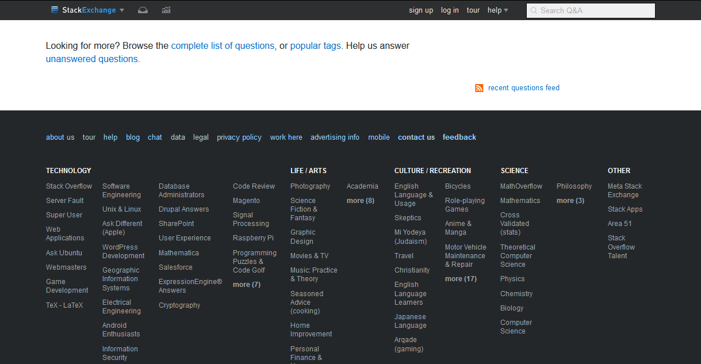

# Stack Exchange Sticky Header

Applies to all Stack Exchange sites.

## Preview

## Installation

A userstyle extension is required, common ones include:

🎨 Stylus for [Firefox](https://addons.mozilla.org/en-US/firefox/addon/styl-us/), [Chrome](https://chrome.google.com/webstore/detail/stylus/clngdbkpkpeebahjckkjfobafhncgmne) or [Opera](https://addons.opera.com/en-gb/extensions/details/stylus/). 
🎨 xStyle for [Firefox](https://addons.mozilla.org/firefox/addon/xstyle/) or [Chrome](https://chrome.google.com/webstore/detail/xstyle/hncgkmhphmncjohllpoleelnibpmccpj).

Then install using one of these methods:

📦 [Install the usercss](https://github.com/StylishThemes/StackExchange-Sticky-Header/raw/master/stack-exchange-sticky-header.user.css) with Stylus or xStyle. Supports automatic updates. 
📦 [Install from userstyles.org](https://userstyles.org/styles/136521) with customization, does not support automatic updates **(NO LONGER UPDATED)**. 

## Contributions

If you would like to contribute to this repository, please...

1. 👓 Read the [contribution guidelines](./CONTRIBUTING.md).
2.  [Fork](https://github.com/StylishThemes/StackExchange-Sticky-Header/fork) or  [download](https://github.com/StylishThemes/StackExchange-Sticky-Header/archive/master.zip) this repository.
3. 👌 Create a pull request!

Thanks to all that have [contributed](./AUTHORS) so far!
