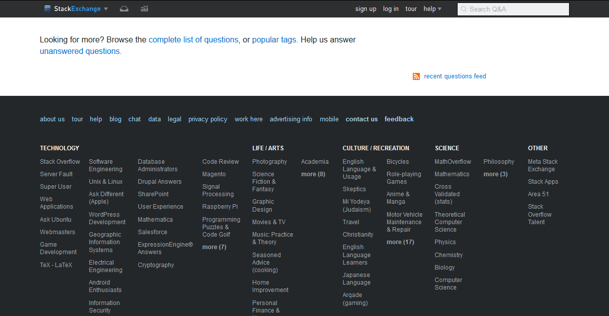

# StackExchange Sticky Header

- Applies to all StackExchange sites.
- Install from [userstyles.org](https://userstyles.org/styles/136521).
- Stylus is available for [Firefox](https://addons.mozilla.org/en-US/firefox/addon/styl-us/), [Chrome](https://chrome.google.com/webstore/detail/stylus/clngdbkpkpeebahjckkjfobafhncgmne) and [Opera](https://addons.opera.com/en-gb/extensions/details/stylus/).
- Stylish is available for [Firefox](https://addons.mozilla.org/en-US/firefox/addon/2108/), [Chrome](https://chrome.google.com/extensions/detail/fjnbnpbmkenffdnngjfgmeleoegfcffe) or [Opera](https://addons.opera.com/en/extensions/details/stylish-for-opera/) and [Firefox Mobile](https://addons.mozilla.org/en-US/firefox/addon/2108/).

## Preview

